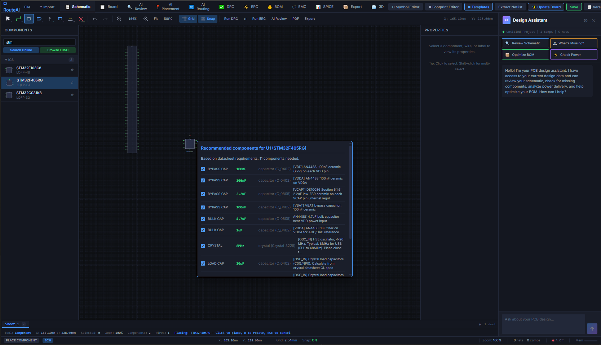
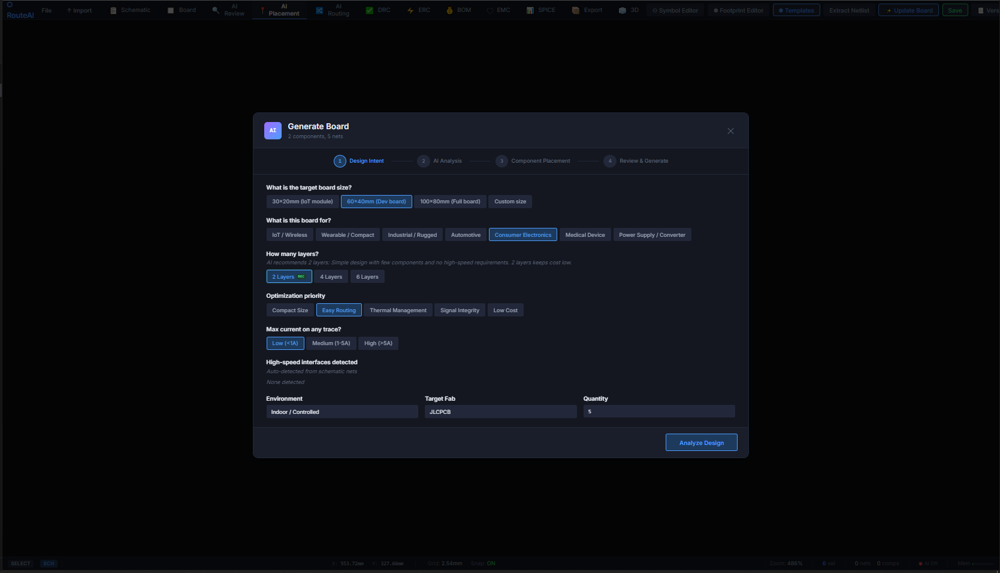
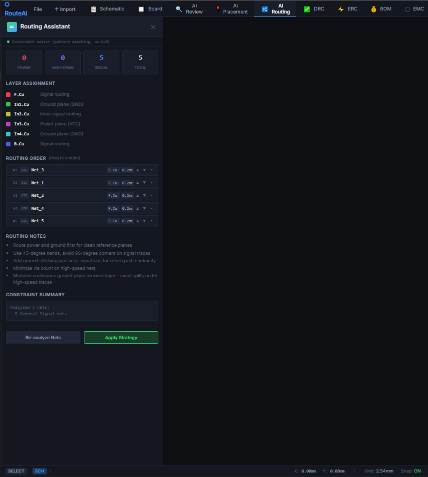
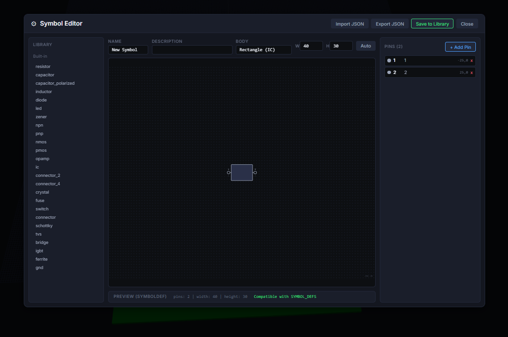
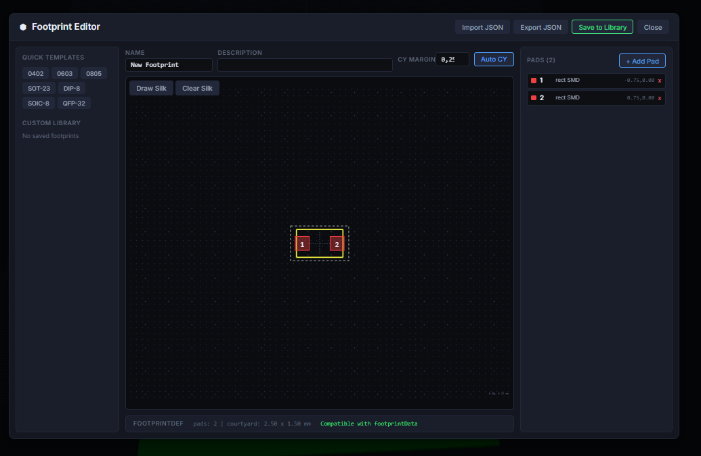

<p align="center">
  
</p>

<h1 align="center">RouteAI</h1>

<p align="center">
  <strong>LLM-Powered Electronic Design Automation Platform for PCB Design</strong>
</p>

<p align="center">
  <a href="#features">Features</a> |
  <a href="#architecture">Architecture</a> |
  <a href="#getting-started">Getting Started</a> |
  <a href="#development">Development</a> |
  <a href="#deployment">Deployment</a> |
  <a href="#license">License</a>
</p>

<p align="center">
  
  
  
  
  
</p>

---

## Overview

RouteAI is an intelligent EDA platform that combines large language models with deterministic solvers to automate and assist PCB (Printed Circuit Board) design workflows. It bridges the gap between human design intent and physical constraints by using LLMs for natural language understanding and expert-grade analysis, while relying on formal solvers for all geometric, electrical, and manufacturing computations.

**Key Principle:** LLMs handle intent interpretation and design review. Deterministic solvers handle all mathematical operations — coordinates, clearances, impedances, and routing are never generated by AI.

---

## Features

### Design Analysis & Review
- **AI-Powered Design Review** — Automated PCB analysis with actionable recommendations following IPC standards
- **3-Gate Validation Pipeline** — Schema validation, confidence scoring, and citation checking for all LLM outputs
- **Schematic Review** — Circuit topology analysis, component selection validation, and net connectivity checks

### Multi-Format Support
- **KiCad** — Full import/export for `.kicad_pcb` and `.kicad_sch` files
- **Eagle** — Full import/export for `.brd` and `.sch` files
- **Gerber/Excellon** — Manufacturing output generation

### Routing Engine
- **A\* Pathfinding** — Heuristic-based trace routing
- **Lee Router** — Breadth-first search for guaranteed completion
- **Differential Pair Routing** — Matched impedance pair routing
- **Length Matching** — Trace equalization for high-speed buses
- **Rip-up and Reroute** — Iterative optimization for congested boards
- **Global Routing** — Multi-net simultaneous routing

### Signal & Power Integrity
- **Impedance Calculation** — Microstrip, stripline, and coplanar waveguide
- **Crosstalk Analysis** — Near-end and far-end coupling estimation
- **Thermal Simulation** — Component and copper thermal analysis
- **IR Drop Analysis** — Power distribution network verification
- **Return Path Analysis** — Signal integrity validation

### Manufacturing
- **DRC Engine** — 50+ design rule checks (geometric, electrical, manufacturing)
- **IPC Compliance** — Automated IPC-2221/IPC-7351 verification
- **DFM Analysis** — Design-for-manufacturing validation
- **BOM Export** — Bill of materials generation
- **Gerber Generation** — Production-ready output files
- **Pick & Place** — Assembly data export

### Component Intelligence
- **Unified Component Search** — Cross-source search across KiCad, Eagle, SnapEDA, LCSC, and EasyEDA libraries
- **RAG Pipeline** — Retrieval-augmented generation from IPC standards, datasheets, and design guidelines
- **17,000+ Indexed Components** — Pre-built component library with symbols and footprints

### Collaboration & Integration
- **Real-Time Collaboration** — WebSocket-based multi-user editing
- **KiCad Plugin** — Direct integration with KiCad 8 PCB editor
- **Version Control** — Built-in Git support for design versioning
- **Air-Gapped Mode** — Fully offline deployment with local LLM (Ollama)

---

## Architecture

```
┌─────────────────────────────────────────────────────────────────────┐
│                         Client Layer                                │
│  ┌──────────┐  ┌──────────────┐  ┌───────────┐  ┌──────────────┐  │
│  │ Web App  │  │ Desktop App  │  │    CLI    │  │ KiCad Plugin │  │
│  │ (React)  │  │ (Electron)   │  │ (Python)  │  │  (Python)    │  │
│  └────┬─────┘  └──────┬───────┘  └─────┬─────┘  └──────┬───────┘  │
└───────┼────────────────┼────────────────┼───────────────┼──────────┘
        │                │                │               │
        └────────────────┴───────┬────────┴───────────────┘
                                 │ REST / WebSocket
┌────────────────────────────────┼───────────────────────────────────┐
│                         API Gateway (Go/Gin)                       │
│                         Port 8080                                  │
│  ┌──────────┐  ┌───────────┐  ┌───────────┐  ┌────────────────┐  │
│  │   Auth   │  │  Projects │  │ WebSocket │  │  Rate Limiter  │  │
│  │  (JWT)   │  │  Manager  │  │    Hub    │  │   Middleware   │  │
│  └──────────┘  └───────────┘  └───────────┘  └────────────────┘  │
└──────────┬──────────────────────────┬─────────────────────────────┘
           │                          │
     ┌─────┴─────┐             ┌──────┴──────┐
     │ ML Service │             │   Router    │
     │ (FastAPI)  │             │   (gRPC)    │
     │ Port 8001  │             │ Port 50051  │
     └─────┬──────┘             └──────┬──────┘
           │                           │
┌──────────┴───────────────────────────┴────────────────────────────┐
│                       Core Services                                │
│  ┌──────────────┐  ┌────────────┐  ┌──────────┐  ┌────────────┐  │
│  │ Intelligence │  │   Solver   │  │  Parsers │  │    Core     │  │
│  │  (LLM/RAG)  │  │ (DRC/SI)   │  │(KiCad/   │  │(Data Model)│  │
│  │             │  │            │  │  Eagle)   │  │            │  │
│  └──────────────┘  └────────────┘  └──────────┘  └────────────┘  │
└───────────────────────────────────────────────────────────────────┘
           │                │                │
┌──────────┴────────────────┴────────────────┴──────────────────────┐
│                       Data Layer                                   │
│  ┌──────────────────┐  ┌─────────┐  ┌──────────────────────────┐  │
│  │ PostgreSQL 16    │  │  Redis  │  │  MinIO (S3-compatible)   │  │
│  │ + PostGIS        │  │   7.x   │  │  Object Storage          │  │
│  │ + pgvector       │  │         │  │                          │  │
│  └──────────────────┘  └─────────┘  └──────────────────────────┘  │
└───────────────────────────────────────────────────────────────────┘
```

---

## Tech Stack

| Layer | Technology | Purpose |
|-------|-----------|---------|
| Frontend | React 18 + TypeScript + Vite | Web application |
| Desktop | Electron 33 | Cross-platform desktop app |
| 3D Rendering | Three.js + React Three Fiber | PCB visualization |
| State Management | Zustand | Client-side state |
| API Gateway | Go 1.22 + Gin | HTTP/WebSocket gateway |
| ML Service | Python 3.11 + FastAPI | LLM orchestration |
| LLM Framework | LangChain + Anthropic SDK | AI agent pipeline |
| Routing Engine | C++17 + gRPC + Protobuf | High-performance routing |
| Constraint Solver | Z3 | Formal verification |
| Database | PostgreSQL 16 + PostGIS + pgvector | Spatial data + embeddings |
| Cache | Redis 7 | Session and rate limiting |
| Object Storage | MinIO | Design file storage |
| CI/CD | GitHub Actions | Automated testing |
| Monitoring | Prometheus + Grafana | Observability |

---

## Project Structure

```
routeai/
├── packages/
│   ├── core/              # Unified PCB data model (Pydantic v2)
│   ├── parsers/           # KiCad/Eagle file parsers and exporters
│   ├── intelligence/      # LLM agents, RAG pipeline, validation
│   ├── solver/            # DRC engine, SI/PI analysis, Z3 constraints
│   ├── api/               # Go API gateway (Gin + JWT + WebSocket)
│   ├── router/            # C++17 routing engine (A*, Lee, diff pair)
│   ├── web/               # React frontend (Three.js, Zustand)
│   ├── cli/               # Command-line interface (Click + Rich)
│   └── kicad-plugin/      # KiCad 8 editor integration
├── app/                   # Electron desktop application
├── infrastructure/
│   ├── docker/            # Dockerfiles for all services
│   ├── k8s/               # Kubernetes manifests
│   ├── monitoring/        # Prometheus + Grafana configs
│   └── air-gapped/        # Offline deployment setup
├── scripts/               # Setup, seeding, and benchmark scripts
├── data/
│   ├── component_library/ # Pre-indexed KiCad component data
│   ├── ipc_standards/     # IPC reference documents
│   ├── benchmarks/        # Performance test data
│   └── reference_designs/ # Sample PCB designs
├── .github/workflows/     # CI/CD pipeline
├── docker-compose.yml     # Development environment
├── docker-compose.prod.yml# Production environment
└── Makefile               # Build automation
```

---

## Getting Started

### Prerequisites

- **Python** 3.11+ with [Poetry](https://python-poetry.org/)
- **Go** 1.22+
- **Node.js** 18+ with npm
- **Docker** and Docker Compose
- **CMake** 3.20+ and **Conan** (for C++ routing engine)

### Quick Start

1. **Clone the repository**

```bash
git clone git@github.com:Guiimartinho/routeai.git
cd routeai
```

2. **Start infrastructure services**

```bash
make dev
```

This starts PostgreSQL (port 5432), Redis (port 6379), and MinIO (ports 9000/9001).

3. **Install Python packages**

```bash
for pkg in core parsers solver intelligence cli; do
  cd packages/$pkg && poetry install && cd ../..
done
```

4. **Build and run the API gateway**

```bash
cd packages/api
go build -o routeai-api .
./routeai-api
```

The API will be available at `http://localhost:8080`.

5. **Start the ML service**

```bash
cd packages/intelligence
poetry run uvicorn routeai_intelligence.ml_service:app --host 0.0.0.0 --port 8001
```

6. **Start the web frontend**

```bash
cd packages/web
npm install
npm run dev
```

The web app will be available at `http://localhost:5173`.

### Environment Variables

Create a `.env` file in the project root:

```env
# Database
POSTGRES_HOST=localhost
POSTGRES_PORT=5432
POSTGRES_USER=routeai
POSTGRES_PASSWORD=routeai_dev
POSTGRES_DB=routeai

# Storage
MINIO_ENDPOINT=localhost:9000
MINIO_ACCESS_KEY=minioadmin
MINIO_SECRET_KEY=minioadmin

# LLM Provider (choose one)
ANTHROPIC_API_KEY=your-api-key
OLLAMA_BASE_URL=http://localhost:11434

# JWT
JWT_SECRET=your-jwt-secret
```

---

## Development

### Commands

```bash
make dev              # Start development infrastructure
make dev-down         # Stop infrastructure services
make test             # Run all package tests
make test-core        # Test core package
make test-parsers     # Test parsers package
make test-intelligence# Test intelligence package
make test-solver      # Test solver package
make test-cli         # Test CLI package
make test-cov         # Run tests with coverage
make lint             # Run ruff + mypy on all packages
make lint-fix         # Auto-fix linting issues
make format           # Format code with ruff
make benchmark        # Run performance benchmarks
make clean            # Remove build artifacts
```

### Code Quality

| Tool | Purpose | Config |
|------|---------|--------|
| Ruff | Linting + formatting | `ruff.toml` |
| MyPy | Static type checking (strict) | `mypy.ini` |
| Pytest | Unit and integration tests | Per-package `pyproject.toml` |
| Google Test | C++ unit tests | `packages/router/CMakeLists.txt` |

### Coverage Targets

| Package | Target |
|---------|--------|
| core | 80% |
| parsers | 80% |
| solver | 70% |
| intelligence | 60% |
| cli | 80% |

### Building the C++ Router

```bash
cd packages/router
mkdir build && cd build
conan install .. --build=missing
cmake .. -DCMAKE_BUILD_TYPE=Release
cmake --build . -j$(nproc)
```

### Building the Desktop App

```bash
cd app
npm install
npm run electron:build          # All platforms
npm run electron:build:win      # Windows
npm run electron:build:linux    # Linux
```

---

## Deployment

### Docker Compose (Production)

```bash
docker-compose -f docker-compose.prod.yml up -d
```

### Kubernetes

```bash
kubectl apply -f infrastructure/k8s/namespace.yaml
kubectl apply -f infrastructure/k8s/
```

### Air-Gapped (Offline)

For secure environments without internet access:

```bash
cd infrastructure/air-gapped
docker-compose -f docker-compose.airgap.yml up -d
```

This deployment uses local Ollama models (Mistral, LLaMA 3.1) instead of cloud APIs.

---

## API Reference

The API gateway exposes the following endpoint groups:

| Endpoint | Method | Description |
|----------|--------|-------------|
| `/api/v1/auth/*` | POST | Authentication (register, login, SSO) |
| `/api/v1/projects/*` | CRUD | Project management |
| `/api/v1/reviews/*` | POST/GET | Design review operations |
| `/api/v1/board/*` | GET/POST | Board data and component queries |
| `/api/v1/chat` | POST | LLM chat interface |
| `/api/v1/tools/*` | POST | DRC, routing, placement tools |
| `/api/v1/workflow/*` | POST/GET | Multi-step analysis workflows |
| `/ws` | WebSocket | Real-time collaboration |
| `/health` | GET | Service health check |

---

## Screenshots

<p align="center">
  
  
</p>
<p align="center">
  
  
</p>

---

## Contributing

1. Fork the repository
2. Create a feature branch (`git checkout -b feature/your-feature`)
3. Ensure tests pass (`make test`)
4. Ensure linting passes (`make lint`)
5. Submit a pull request

All new code must include tests and maintain the established coverage targets.

---

## License

This project is licensed under the MIT License. See individual package files for details.

---

<p align="center">
  <strong>RouteAI</strong> — Intelligent PCB Design, Powered by AI.
</p>
