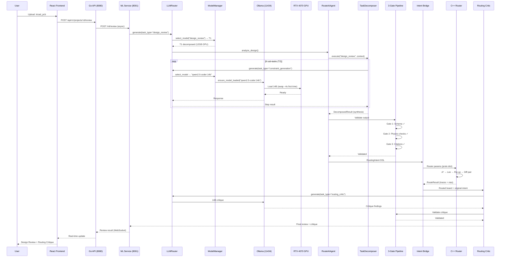
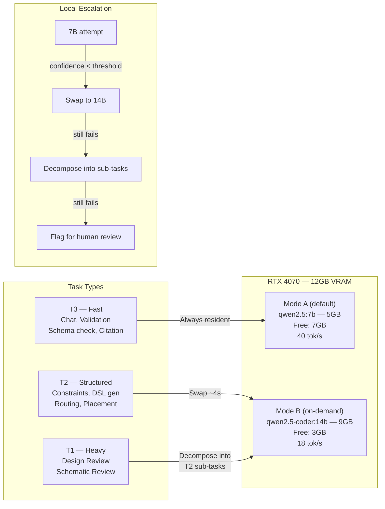
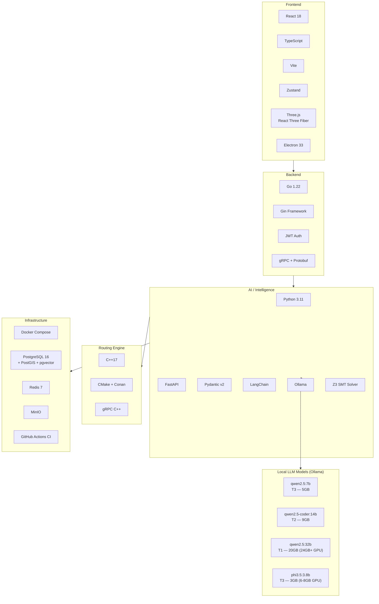

# RouteAI — Full Architecture Diagram

> 100% Local. All LLM inference via Ollama. No cloud APIs.

## Complete System Architecture

```mermaid
graph TB
    subgraph CLIENT["Client Layer"]
        direction TB
        subgraph WEB["Web App — React 18 + TypeScript + Vite"]
            AIPanel["AIPanel.tsx<br/>GPU Status + Chat"]
            AIReview["AIDesignReview.tsx<br/>Design Review Panel"]
            AIRouting["AIRoutingAssistant.tsx<br/>Routing Strategy"]
            AIWizard["AIBoardWizard.tsx<br/>Placement Wizard"]
            IntentPrev["IntentPreview.tsx<br/>DSL Preview + Approve"]
            DecompProg["DecomposedProgress.tsx<br/>Step-by-Step Progress"]
            BoardEdit["BoardEditor.tsx<br/>2D PCB Canvas"]
            BoardGL["BoardCanvasGL.tsx<br/>WebGL Renderer"]
            Board3D["BoardViewer3D.tsx<br/>Three.js 3D View"]
            SchEdit["SchematicEditor.tsx<br/>Circuit Editor"]
            DRC_UI["DesignRuleCheck.tsx<br/>DRC Panel"]
            BOM_UI["BOMPanel.tsx<br/>Bill of Materials"]
            CompSearch["ComponentSearch.tsx<br/>Library Search"]
        end
        subgraph HOOKS["React Hooks + State"]
            useOllama["useOllama.ts<br/>GPU-aware model selection<br/>Tier routing: T3/T2/T1"]
            projStore["projectStore.ts<br/>Zustand State"]
            backendAPI["backend.ts<br/>REST Client"]
        end
        ELECTRON["Electron 33<br/>Desktop App Wrapper"]
        CLI_APP["CLI — Python Click + Rich"]
        KICAD_PLUGIN["KiCad 8 Plugin — Python"]
    end

    subgraph GATEWAY["API Gateway — Go 1.22 + Gin"]
        direction TB
        AUTH["Auth Handler<br/>JWT + Dev Mode"]
        HEALTH["Health Handler<br/>+ Ollama Proxy"]
        OLLAMA_CFG["OllamaConfig<br/>GPU Profile Endpoint"]
        CHAT_H["Chat Handler<br/>→ ML Service"]
        REVIEW_H["Review Handler<br/>Async → ML Service"]
        TOOLS_H["Tools Handler<br/>Impedance + Current Calc"]
        WORKFLOW_H["Workflow Handler<br/>AI Placement/Review/Routing"]
        COMP_H["Components Handler<br/>KiCad Library Search"]
        WS_H["WebSocket Hub<br/>Real-time Collab"]
        subgraph MW["Middleware"]
            CORS["CORS"]
            RATE["Rate Limiter"]
            JWT["JWT Auth"]
        end
        subgraph STORE["Storage"]
            MINIO_C["MinIO Client<br/>S3-compatible"]
            DB_C["SQLite/PostgreSQL<br/>Projects + Reviews"]
        end
    end

    subgraph INTELLIGENCE["Intelligence Layer — Python 3.11 + FastAPI"]
        direction TB
        subgraph ML_SVC["ML Service (port 8001)"]
            ML_REVIEW["/ml/review"]
            ML_CHAT["/ml/chat"]
            ML_ROUTING["/ml/routing-strategy"]
            ML_PLACE["/ml/placement"]
            ML_CONSTR["/ml/constraints"]
            ML_GPU["/ml/gpu-info"]
        end
        subgraph LLM_LAYER["LLM Layer"]
            ROUTER["LLMRouter<br/>Task-type aware<br/>Ollama ONLY"]
            MODEL_MGR["ModelManager<br/>VRAM-aware<br/>GPU Profiles"]
            GPU_DETECT["gpu_detect.py<br/>nvidia-smi"]
            OLLAMA_PROV["OllamaProvider<br/>model_override<br/>ensure_model_loaded<br/>swap manager"]
        end
        subgraph AGENTS["Agent Layer"]
            CORE_AGENT["RouteAIAgent<br/>ReAct Loop (15 iter)<br/>+ ReActState dedup"]
            DECOMPOSER["TaskDecomposer<br/>T1→T2 sub-tasks"]
            REVIEWER["Design Reviewer"]
            SCH_REVIEW["Schematic Reviewer"]
            ROUTING_DIR["Routing Director<br/>→ RoutingIntent DSL"]
            PLACE_STRAT["Placement Strategy<br/>→ PlacementIntent DSL"]
            ROUTING_CRIT["Routing Critic<br/>Post-solver analysis"]
            CONFLICT_RES["Conflict Resolver<br/>Domain priority mediation"]
            STYLE_LEARN["Style Learner<br/>Feature extraction"]
            POWER_BUD["Power Budget Analyzer"]
            SEM_ERC["Semantic ERC"]
            THERMAL_ADV["Thermal Advisor"]
            FAB_ADV["Fabrication Advisor"]
            COMP_SEL["Component Selector"]
        end
        subgraph VALIDATION["3-Gate Validation Pipeline"]
            GATE1["Gate 1: Schema Validator<br/>JSON Schema compliance"]
            GATE2["Gate 2: Confidence + Physics<br/>Boundary checks (deterministic)<br/>Escalation policy"]
            GATE3["Gate 3: Citation Checker<br/>IPC/datasheet references"]
        end
        subgraph TOOLS["Agent Tools"]
            T_IMPED["impedance_calc<br/>Hammerstad-Jensen"]
            T_CLEAR["clearance_lookup<br/>IPC-2221B"]
            T_DRC["drc_check<br/>→ Solver DRC"]
            T_DSHEET["datasheet_lookup<br/>→ RAG"]
            T_STACK["stackup_suggest"]
            T_COMP["component_search"]
        end
        subgraph BRIDGE["Intent Bridge"]
            I2S["intent_to_solver.py<br/>DSL → Router Params<br/>DSL → Design Rules<br/>DSL → PI Params"]
        end
        subgraph RAG["RAG Pipeline"]
            EMBED["Embeddings"]
            RETRIEVER["Retriever"]
            IPC_IDX["IPC Standards Index"]
        end
    end

    subgraph SOLVER["Solver Layer — Python + Z3"]
        direction TB
        subgraph DRC_ENG["DRC Engine"]
            GEO_DRC["Geometric Checks<br/>Clearance, Width, Ring"]
            ELEC_DRC["Electrical Checks<br/>Connectivity, Shorts"]
            MFG_DRC["Manufacturing Checks<br/>Drill, Mask, Paste"]
        end
        subgraph PHYSICS["Physics Solvers"]
            IMPED_CALC["Impedance Calculator<br/>IPC-2141A"]
            THERM_CALC["Thermal Analysis<br/>IPC-2152"]
            XTALK_CALC["Crosstalk Analysis<br/>NEXT/FEXT"]
        end
        subgraph SI["Signal Integrity"]
            SI_IMPED["Impedance Engine"]
            SI_XTALK["Crosstalk Engine"]
            SI_RETURN["Return Path Analyzer"]
            SI_PDN["PDN Analyzer"]
        end
        subgraph PI["Power Integrity"]
            PI_IRDROP["IR Drop Analysis"]
            PI_COPPER["Copper Analysis"]
        end
        subgraph Z3_SOLVE["Constraint Solver"]
            Z3_LEN["Length Matching<br/>Z3 SMT"]
            Z3_SKEW["Diff Pair Skew<br/>Z3 SMT"]
            Z3_TIME["Timing Constraints<br/>Z3 SMT"]
        end
        subgraph MFG["Manufacturing Export"]
            GERBER["Gerber Generator"]
            DRILL["Drill Files"]
            BOM_EXP["BOM Export"]
            PNP["Pick & Place"]
            IPC2581["IPC-2581"]
            ODB["ODB++"]
        end
    end

    subgraph ROUTER_CPP["Routing Engine — C++17 + gRPC"]
        direction TB
        GRPC_SRV["gRPC Server<br/>RoutingService"]
        subgraph ALGORITHMS["Routing Algorithms"]
            ASTAR["A* Router<br/>Cost: via + direction + congestion"]
            LEE["Lee Router<br/>BFS guaranteed completion"]
            DIFFPAIR["Diff Pair Router<br/>Edge/broadside coupled"]
            GLOBAL["Global Router<br/>Congestion-aware"]
            RIPUP["Rip-up & Reroute"]
            LENMATCH["Length Matcher<br/>Serpentine"]
        end
        GRID["RoutingGrid<br/>Multi-layer occupancy"]
        SPATIAL["Spatial Index"]
    end

    subgraph DATA["Data Layer"]
        subgraph CORE_MODELS["Core Models — Pydantic v2"]
            PHY_MODEL["physical.py<br/>BoardDesign, Trace, Via, Pad"]
            SCH_MODEL["schematic.py<br/>SchematicDesign, Component, Net"]
            CONST_MODEL["constraints.py<br/>NetClass, DiffPair, LengthGroup"]
            STACK_MODEL["stackup.py<br/>StackUp, Layer, DielectricLayer"]
            INTENT_MODEL["intent.py<br/>PlacementIntent<br/>RoutingIntent<br/>(NO coordinates)"]
            MFG_MODEL["manufacturing.py<br/>FabSpec, BOM, P&P"]
        end
        subgraph PARSERS["Parsers"]
            KICAD_P["KiCad Parser<br/>.kicad_pcb / .kicad_sch"]
            EAGLE_P["Eagle Parser<br/>.brd / .sch"]
        end
        POSTGRES["PostgreSQL 16<br/>+ PostGIS + pgvector"]
        REDIS["Redis 7<br/>Sessions + Cache"]
        MINIO_S["MinIO<br/>Design Files"]
    end

    subgraph OLLAMA_SVC["Ollama Server (port 11434)"]
        direction LR
        subgraph GPU["NVIDIA GPU (RTX 4070 12GB)"]
            T3_MODEL["T3: qwen2.5:7b<br/>5GB — Always resident<br/>Chat, Validation, Fast"]
            T2_MODEL["T2: qwen2.5-coder:14b<br/>9GB — Swap on demand<br/>DSL, Constraints, Analysis"]
        end
    end

    %% Client → Gateway
    WEB -->|"REST / WebSocket<br/>port 3000 → proxy → 8080"| GATEWAY
    ELECTRON --> WEB
    CLI_APP -->|"REST"| GATEWAY
    KICAD_PLUGIN -->|"REST"| GATEWAY

    %% Hooks → Gateway
    useOllama -->|"/api/ollama/chat<br/>(streaming NDJSON)"| HEALTH
    useOllama -->|"/api/ollama/config"| OLLAMA_CFG
    backendAPI -->|"/api/v1/*"| GATEWAY

    %% Gateway → Intelligence
    CHAT_H -->|"POST /ml/chat"| ML_CHAT
    REVIEW_H -->|"POST /ml/review<br/>(async, 120s timeout)"| ML_REVIEW
    WORKFLOW_H -->|"POST /ml/placement<br/>POST /ml/routing"| ML_PLACE
    OLLAMA_CFG -->|"GET /ml/gpu-info"| ML_GPU
    HEALTH -->|"Proxy /api/chat"| OLLAMA_SVC

    %% Intelligence internal
    ML_GPU --> GPU_DETECT
    GPU_DETECT --> MODEL_MGR
    MODEL_MGR --> ROUTER
    ROUTER --> OLLAMA_PROV
    OLLAMA_PROV -->|"/api/chat<br/>/api/generate"| OLLAMA_SVC
    ROUTER --> CORE_AGENT
    CORE_AGENT --> DECOMPOSER
    CORE_AGENT --> AGENTS
    DECOMPOSER -->|"T1 → T2 sub-tasks"| ROUTER

    %% Agent outputs
    PLACE_STRAT -->|"PlacementIntent DSL"| GATE1
    ROUTING_DIR -->|"RoutingIntent DSL"| GATE1
    GATE1 --> GATE2
    GATE2 --> GATE3
    GATE3 -->|"Validated DSL"| I2S

    %% Conflict detection
    PLACE_STRAT --> CONFLICT_RES
    ROUTING_DIR --> CONFLICT_RES
    CONFLICT_RES -->|"Resolved DSL"| I2S

    %% Bridge → Solvers
    I2S -->|"Router Params<br/>(proto-compatible dict)"| GRPC_SRV
    I2S -->|"Design Rules"| DRC_ENG
    I2S -->|"PI Params"| PI

    %% Router internal
    GRPC_SRV --> GLOBAL
    GLOBAL --> ASTAR
    ASTAR --> LEE
    LEE --> RIPUP
    RIPUP --> DIFFPAIR
    DIFFPAIR --> LENMATCH
    ASTAR --> GRID
    LEE --> GRID

    %% Post-solver critique
    GRPC_SRV -->|"RouteResult"| ROUTING_CRIT
    ROUTING_CRIT -->|"Critique findings"| GATE1

    %% Tools → Solvers
    T_IMPED --> IMPED_CALC
    T_DRC --> DRC_ENG
    T_DSHEET --> RAG

    %% Data flow
    KICAD_P --> PHY_MODEL
    EAGLE_P --> PHY_MODEL
    PHY_MODEL --> CORE_AGENT
    INTENT_MODEL --> I2S

    %% Style Learner
    PHY_MODEL --> STYLE_LEARN
    STYLE_LEARN -->|"RoutingStyleProfile"| POSTGRES

    %% GPU model management
    MODEL_MGR -->|"select_model(task_type)"| OLLAMA_PROV
    OLLAMA_PROV -->|"ensure_model_loaded()"| GPU
```

## Data Flow: Schematic → Validated Output

## GPU Model Management

## Technology Stack

