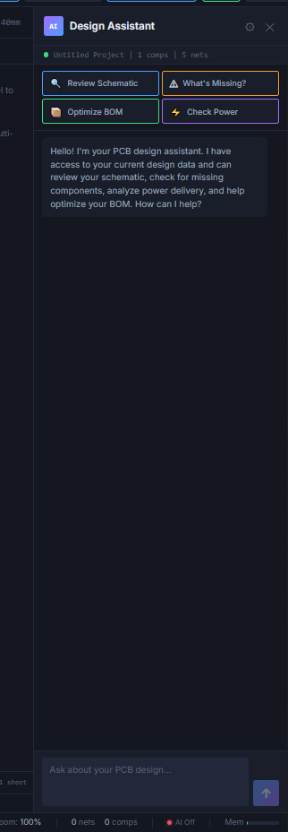
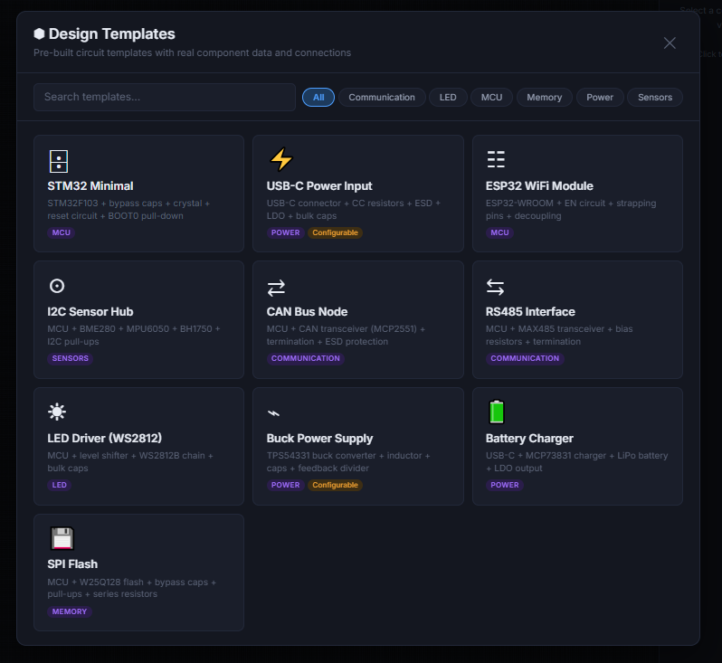
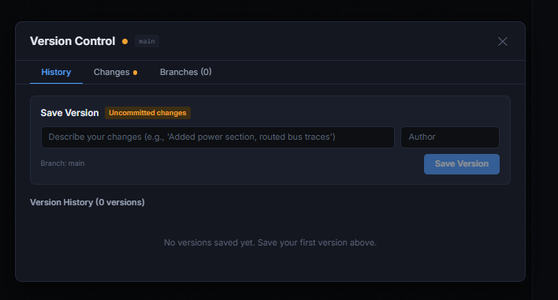

# LLM Local no Design de PCB: O Projeto RouteAI

*Imagem de destaque: images/Capturar.PNG (850x510px — recortar se necessário)*

*Crédito para a imagem destacada: Luiz Guilherme / RouteAI*

## Introdução

O design de placas de circuito impresso (PCB) é uma das etapas mais complexas no desenvolvimento de sistemas embarcados. Ferramentas como KiCad, Altium Designer e EasyEDA oferecem ambientes completos para captura esquemática, layout de board e geração de arquivos de fabricação. No entanto, nenhuma dessas ferramentas integra inteligência artificial ao fluxo de trabalho do engenheiro.

Este artigo apresenta o RouteAI EDA, uma plataforma de design de PCB em desenvolvimento que integra modelos de linguagem (LLM) rodando localmente via Ollama para automatizar tarefas que tradicionalmente dependem da experiência do projetista: revisão de design, sugestão de componentes, análise de EMC e estratégia de roteamento.

## Por que integrar LLM ao design de PCB?

Projetar uma PCB envolve centenas de micro-decisões baseadas em conhecimento contextual. Por exemplo:

- Capacitores de bypass devem estar a menos de 2mm dos pinos de alimentação do microcontrolador;
- Trilhas USB diferenciais precisam de impedância controlada de 90 ohms;
- Reguladores de tensão com pad exposto necessitam de thermal vias para dissipação;
- Cristais devem ficar o mais próximo possível dos pinos do MCU, com trilhas curtas e guarda de terra ao redor.

Essas regras estão distribuídas entre datasheets, application notes, normas IPC e anos de experiência prática. Um engenheiro sênior aplica essas regras intuitivamente. Um engenheiro em formação precisa pesquisar cada decisão individualmente.

A proposta do RouteAI é colocar esse conhecimento dentro da ferramenta. A LLM não substitui o engenheiro — funciona como um assistente que analisa o design em tempo real, identifica problemas e sugere correções antes da fabricação.


Figura 1 - Editor esquemático do RouteAI com popup de Component Suggestion recomendando componentes auxiliares para um STM32F103

Na Figura 1, ao inserir um microcontrolador STM32F103 no schematic, o sistema automaticamente identifica o tipo de componente e exibe uma lista de componentes recomendados: bypass capacitors, crystal, resistor de reset e outros componentes essenciais extraídos do datasheet. Cada sugestão inclui o valor, footprint e justificativa técnica.

### Decisão arquitetural: LLM para contexto, solvers para cálculo

Um ponto fundamental do projeto é a separação clara entre o que a LLM faz e o que os algoritmos determinísticos fazem:

- **LLM cuida de**: intenção do usuário, análise contextual, explicação de decisões, sugestão de componentes, interpretação de datasheets;
- **Solvers determinísticos cuidam de**: cálculo de impedância (IPC-2141A), capacidade de corrente (IPC-2152), DRC geométrico, placement via Simulated Annealing, roteamento via A*.

Nunca geramos coordenadas ou valores numéricos com a LLM. Ela decide "o quê" e "por quê"; os algoritmos executam o "como".

## Arquitetura do sistema

O RouteAI utiliza uma arquitetura de microsserviços com quatro camadas:

```
Frontend (:3000) → Go API Gateway (:8080) → Python ML Service (:8001) → Ollama (:11434)
```

Tabela 1 - Serviços da arquitetura RouteAI

| Serviço | Porta | Tecnologia | Função |
|---------|-------|------------|--------|
| Frontend | 3000 | React 18 + TypeScript + Vite | Interface do usuário (schematic, board, painéis AI) |
| API Gateway | 8080 | Go 1.22 + Gin | Roteamento, autenticação JWT, proxy ML, cálculos IPC |
| ML Service | 8001 | Python 3.11 + FastAPI | Endpoints de AI/LLM (review, chat, RAG, placement) |
| Ollama | 11434 | Ollama | Inferência do modelo LLM local |

O frontend nunca se comunica diretamente com o Ollama ou o serviço ML. Todas as requisições passam pelo gateway Go, que faz proxy para o serviço apropriado. Isso permite autenticação centralizada, rate limiting e logging unificado.

### Por que Go para o backend?

A escolha de Go para o API Gateway se deve a três fatores: compilação para binário estático (deploy simplificado), performance superior para proxy de requisições HTTP e tipagem forte que reduz bugs em produção. Cálculos de engenharia como impedância de microstrip e capacidade de corrente de trilha foram implementados diretamente em Go, eliminando dependência do serviço Python para operações que não envolvem LLM.

### Por que Ollama?

O Ollama permite executar modelos como Qwen 2.5 Coder (7B/14B parâmetros) localmente, sem enviar dados para servidores externos. Para um engenheiro trabalhando em projetos proprietários, isso é essencial — o design da PCB nunca sai da máquina local.

## Stack técnico completo

Tabela 2 - Tecnologias utilizadas no projeto

| Camada | Tecnologias |
|--------|-------------|
| Frontend | React 18, TypeScript 5, Vite 5, Zustand, Three.js, Canvas 2D, Electron 33 |
| Backend | Go 1.22, Gin, JWT, WebSocket (Gorilla), PostgreSQL, MinIO |
| ML/AI | Python 3.11, FastAPI, LangChain, Ollama, RAG Pipeline, NumPy |
| Infra | Docker Compose, Poetry, Monorepo (9 pacotes) |

## Features de AI em detalhe

### AI Board Wizard — Geração inteligente de board

O AI Board Wizard guia o engenheiro na configuração inicial do board através de perguntas contextuais sobre a aplicação, como mostra a Figura 2.


Figura 2 - AI Board Wizard com seleção de tamanho, aplicação, número de camadas, prioridade de otimização e fab house alvo

O wizard coleta informações sobre o tamanho do board, tipo de aplicação (IoT, automotivo, consumer electronics), número de camadas, prioridade de otimização (tamanho compacto, facilidade de roteamento, thermal management, signal integrity ou custo), corrente máxima esperada e fab house alvo (JLCPCB, PCBWay, etc.). Com base nessas informações, a AI recomenda o número de camadas — na Figura 2, por exemplo, o sistema recomenda 2 layers para um design simples sem requisitos de alta velocidade.

### AI Routing Assistant

O Routing Assistant analisa todas as nets do design e gera uma estratégia de roteamento completa, incluindo atribuição de camadas e ordem de roteamento.


Figura 3 - AI Routing Assistant com layer assignment, routing order e routing notes geradas automaticamente

Na Figura 3, o sistema classificou automaticamente 5 nets em categorias (power, high-speed, signal), atribuiu cada camada a uma função (F.Cu para signal routing, In1.Cu para ground plane, In2.Cu para inner signal, In3.Cu para power plane, In4.Cu para ground, B.Cu para signal) e gerou routing notes com boas práticas: rotear power e ground primeiro, usar bends de 45 graus, adicionar via stitching e manter ground plane contínuo.

### AI Design Assistant — Chat contextual

O Design Assistant é um chat integrado que tem acesso ao estado atual do design — componentes, nets, regras — e responde perguntas com base no circuito que o engenheiro está projetando.



Figura 4 - Painel do AI Design Assistant com quick actions para Review Schematic, What's Missing, Optimize BOM e Check Power

O painel oferece quatro ações rápidas: Review Schematic (auditoria completa), What's Missing (identifica componentes faltantes), Optimize BOM (análise de custo) e Check Power (verifica distribuição de alimentação). Além disso, o engenheiro pode fazer perguntas livres como "preciso de pull-ups no barramento I2C?" e receber uma resposta contextualizada.

### Design Templates

Para acelerar o início de novos projetos, o RouteAI inclui 10 templates de circuitos completos com componentes reais, valores e conexões.



Figura 5 - Biblioteca de Design Templates com circuitos prontos organizados por categoria

Os templates incluem: STM32 Minimal (MCU + bypass + crystal + reset), USB-C Power Input, ESP32 WiFi Module, I2C Sensor Hub, CAN Bus Node, RS485 Interface, LED Driver WS2812, Buck Power Supply, Battery Charger e SPI Flash. Cada template pode ser inserido diretamente no schematic como ponto de partida.

## Editores de componentes

### Symbol Editor

O RouteAI inclui um editor de símbolos esquemáticos integrado com biblioteca de tipos pré-definidos.


Figura 6 - Symbol Editor com biblioteca de tipos built-in (resistor, capacitor, diodo, transistor, opamp, IC, conectores) e preview em tempo real

### Footprint Editor

O editor de footprints permite criar e editar footprints com templates rápidos para encapsulamentos padrão.


Figura 7 - Footprint Editor com quick templates (0402, 0603, 0805, SOT-23, DIP-8, SOIC-8, QFP-32), pads SMD e courtyard automático

## Controle de versão integrado

O RouteAI implementa controle de versão diretamente no navegador usando isomorphic-git com armazenamento em IndexedDB, sem necessidade de Git externo.



Figura 8 - Painel de Version Control com histórico de versões, tracking de mudanças e suporte a branches

## Os 19 engines algorítmicos

O núcleo do RouteAI são 19 módulos de processamento implementados em TypeScript no frontend, permitindo execução em tempo real sem round-trip ao servidor:

**Roteamento e layout:** Placement Solver (Simulated Annealing), Routing Solver (A* com pattern matching), Push & Shove Router, Differential Pair Router, Length Tuner (serpentine e trombone).

**Verificação:** DRC Engine (clearance, largura mínima, keepout zones), ERC Engine (7 regras elétricas).

**Fabricação:** Gerber Generator (RS-274X, Excellon, BOM, Pick & Place), Zone Fill (copper pour com thermal relief).

**Simulação:** SPICE Netlist Generator, SPICE MNA Solver (DC operating point).

**AI e conhecimento:** Component Rules (25 regras genéricas + 55 detectores), Datasheet Knowledge (22 famílias IC), Component Suggester (3 níveis), Design Templates (10 circuitos).

**Utilitários:** KiCad Importer (parser S-expression), Cross-Probe (bidirecional schematic/board), Git Manager, Board Undo/Redo.

## Números do projeto atual

Tabela 3 - Métricas do codebase

| Métrica | Valor |
|---------|-------|
| Total de linhas de código | 102.859 |
| Arquivos TypeScript/React | 80 (56.225 LOC) |
| Arquivos Go | 34 (9.057 LOC) |
| Arquivos Python | 62 (37.577 LOC) |
| Componentes React | 42 |
| Engines algorítmicos | 19 |
| Rotas na API Go | 49 |
| Endpoints ML | 11 |
| Componentes pesquisáveis | 17.009 (409 locais + 16.600 KiCad) |
| Símbolos KiCad indexados | 8.197 (394.006 pinos) |

## O que está em desenvolvimento

O projeto ainda está em fase ativa de desenvolvimento. As seguintes funcionalidades estão sendo trabalhadas:

- **Ajuste dos símbolos dos componentes** — refinamento da renderização e pinagem visual para fidelidade com os padrões KiCad;
- **Auto-distribuição de componentes via LLM** — otimização de placement com análise contextual do circuito;
- **Recomendação automática de espessura de trilhas e camadas** — integração dos cálculos de EMI, impedância controlada e capacidade de corrente para sugerir stackup e largura de trilha automaticamente;
- **Compatibilidade com Altium e EasyEDA** — importação de .PcbDoc/.SchDoc e formato JSON do EasyEDA em fase de ajuste;
- **Expansão da biblioteca de componentes** — integração com APIs de terceiros (JLCPCB, LCSC, SnapEDA) em andamento;
- **Teardrops automáticos** para melhoria de DFM;
- **Plugin API em Python** para extensibilidade;
- **Simulação de Signal e Power Integrity**;
- **BGA escape routing**.

## Conclusão

A integração de LLM ao fluxo de design de PCB representa uma mudança de paradigma: ao invés de consultar datasheets e normas manualmente, o engenheiro recebe análise contextual em tempo real. O RouteAI demonstra que é possível combinar solvers determinísticos (para precisão matemática) com modelos de linguagem (para raciocínio contextual), mantendo tudo rodando localmente sem dependência de cloud.

O projeto utiliza como referência de funcionalidade e compatibilidade as ferramentas que são padrão da indústria — KiCad, Altium Designer e EasyEDA — com o objetivo de atingir e superar o nível de funcionalidade que engenheiros de hardware esperam de um EDA profissional, adicionando uma camada de inteligência que nenhuma dessas ferramentas oferece hoje.

O código-fonte está disponível no GitHub e contribuições são bem-vindas.

## Referências

- IPC-2141A — Design Guide for High-Speed Controlled Impedance Circuit Boards
- IPC-2152 — Standard for Determining Current-Carrying Capacity in Printed Board Design
- Ollama — https://ollama.ai
- KiCad EDA — https://www.kicad.org
- Gin Web Framework — https://gin-gonic.com
- FastAPI — https://fastapi.tiangolo.com
- LangChain — https://www.langchain.com
- Qwen 2.5 Coder — https://huggingface.co/Qwen
